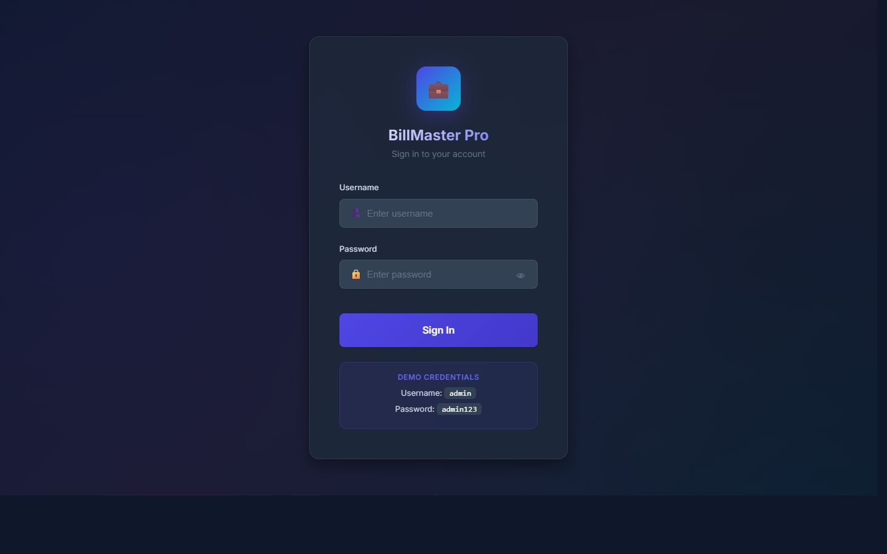
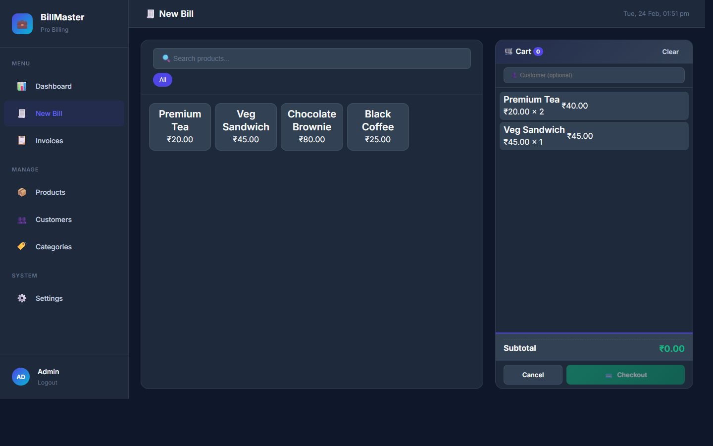
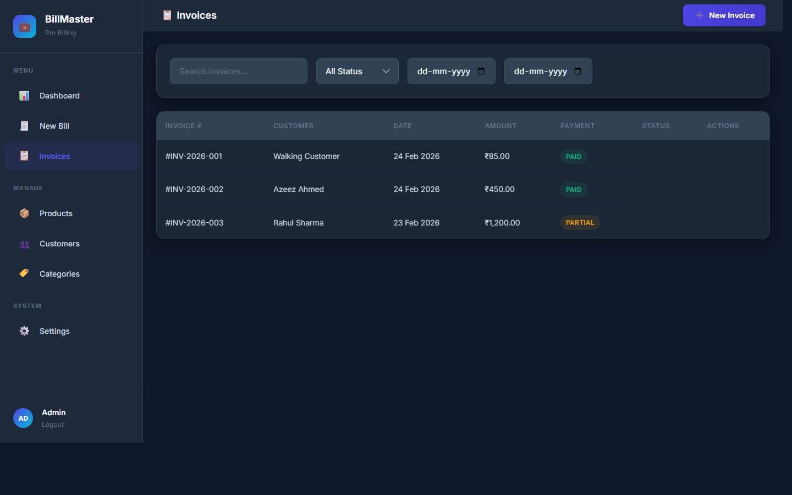
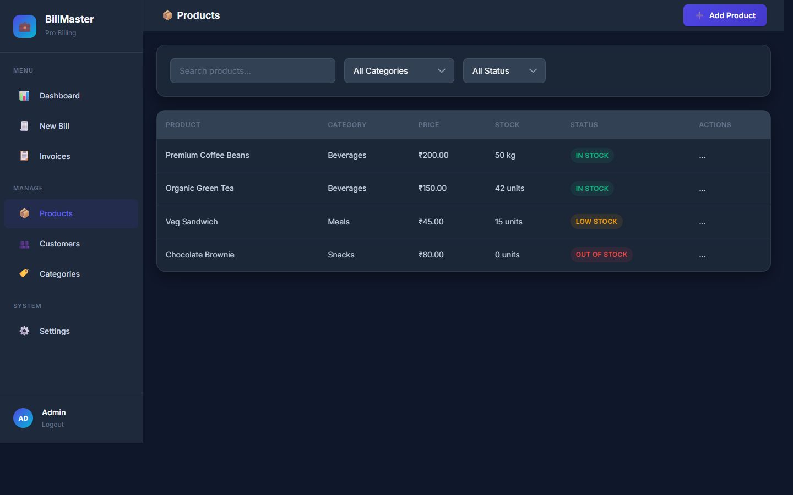
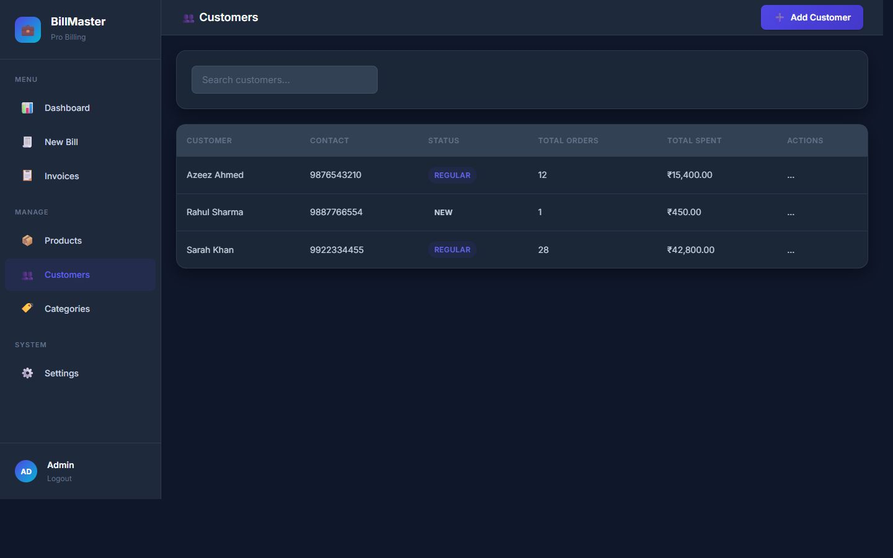
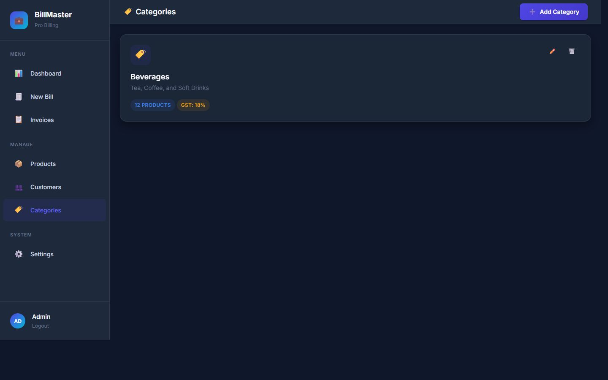
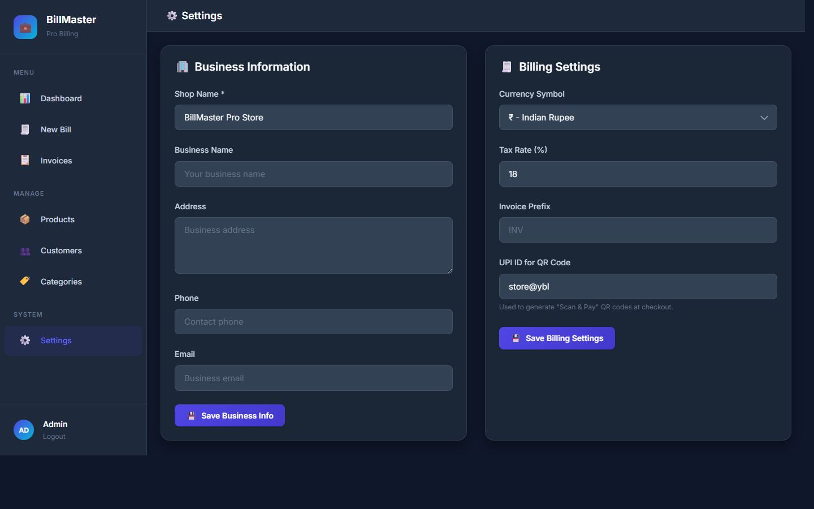

# BILLMASTER PRO - BILLING AND INSTITUTE MANAGEMENT SYSTEM

## FRONT PAGE

**BILLMASTER PRO - BILLING AND INSTITUTE MANAGEMENT SYSTEM**

A project work submitted to Jamal Mohamed College in partial fulfilment of the requirements for the award of the degree of

**B.Sc. Computer Science**

Submitted by

**Abdul Azeez M (23UCS004)
Abdul Salam A (23UCS005)
Abu Backer Siddque M (23UCS006)**

Guided by

**Dr. S. Mohamed Iliyas
Assistant Professor**

**PG & Research Department of Computer Science**
**Jamal Mohamed College**
(Autonomous)
Accredited with A++ Grade by NAAC (4th Cycle) with CGPA 3.69 out of 4.0
(Affiliated to Bharathidasan University)
Tiruchirappalli - 620 020
April 2026

---

## BONAFIDE CERTIFICATE

This is to certify that the project work entitled **"BILLMASTER PRO - BILLING AND INSTITUTE MANAGEMENT SYSTEM"** submitted in partial fulfillment of the requirements for the award of the degree of **B.Sc. Computer Science** to **Jamal Mohamed College**, Tiruchirappalli is a record of bonafide work carried out by **Abdul Azeez M, Abdul Salam A, Abu Backer Siddque M** during the year 2023-2026 under my supervision and guidance.

Date: ____________                                Signature of the Guide

---

## CERTIFICATE

This is to certify that this project entitled “BILLMASTER PRO - BILLING AND INSTITUTE MANAGEMENT SYSTEM” submitted in partial fulfillment of the requirements for the award of the degree of Bachelor of Science in Computer Science to the Jamal Mohamed College, Tiruchirappalli is a bonafide record of the work done by

Abdul Azeez M (23UCS004)
Abdul Salam A (23UCS005)
Abu Backer Siddque M (23UCS006)

under my supervision and guidance.

---
## ACKNOWLEDGEMENTS

We express our sincere gratitude to the Almighty for granting us the strength and guidance to complete this project. We convey our heartfelt thanks to our parents for their constant support and encouragement.

We are deeply grateful to our Guide, **Dr. S. Mohamed Iliyas**, for their invaluable suggestions and guidance throughout the project. We also thank our Head of Department and all faculty members for their technical support.

---

## ABSTRACT

**BillMaster Pro** is an advanced, automated Billing and Management System designed to streamline retail and institutional transactions. Built using **Python/Flask** and **SQLite**, the system offers a professional, user-friendly interface for managing products, customers, and financial records. Key innovations include a dynamic **UPI QR Code generator**, an **advanced customer loyalty discount system**, and a **professional multi-method payment workflow**. The system ensures high performance through precision database indexing and secures data via bcrypt hashing. It eliminates traditional manual errors and provides real-time analytics for informed business decision-making.

---

# 1. INTRODUCTION

The BillMaster Pro system is a modern solution for businesses seeking an efficient alternative to manual billing systems or complex ERPs. In today's digital economy, businesses need fast, reliable, and professional tools to manage sales and inventories. This project addresses these needs by providing a centralized dashboard for all operations, ensuring accuracy in calculations, and offering convenient payment methods including UPI and Cards.

## 2.a EXISTING SYSTEM

Many small businesses still rely on manual registers or standalone spreadsheets. These methods require repetitive data entry, are prone to human calculation errors, and make it difficult to track order history or generate analytics. Tracking credit payments and customer-specific discounts in such systems is particularly challenging and unstructured.

## 2.b PROPOSED SYSTEM

The proposed system, **BillMaster Pro**, automates the entire billing lifecycle. It features a robust backend that handles data integrity and a responsive frontend for seamless interaction.
- **Advanced Payment Handling**: Supports Cash, Card, and UPI with specific data verification (Card digits, UPI UTR).
- **Instant Scan & Pay**: Generates dynamic QR codes pre-filled with the exact bill amount.
- **Customer Intelligence**: Tracks customer status and applies automated loyalty discounts.
- **Real-time Analytics**: Visualized trends via Chart.js and compact, aligned stat cards.

---

# 3. SYSTEM DESCRIPTION

## 3.1 HARDWARE & SOFTWARE REQUIREMENTS

### Hardware:
- Processor: Intel Core i3 or equivalent (minimum)
- RAM: 4GB (minimum)
- Storage: 100MB for application + Data growth

### Software:
- OS: Windows 10+, macOS, or Linux
- Environment: Python 3.8+
- Tools: VS Code, Browser (Chrome/Edge/Firefox)

## 3.2 SYSTEM MODULES / PAGE DESCRIPTION

### 3.2.1 LOGIN PAGE
Secure entry point using credentials (admin/staff). Uses session management to prevent unauthorized access.

### 3.2.2 DASHBOARD & ANALYTICS
A professional, single-line alignment of key metrics (Revenue, Invoices, Items Sold). Includes Chart.js visualizations for sales trends and payment method distribution.

### 3.2.3 BILLING (POS) PAGE
The core of the application. Users can select products, adjust quantities, manage customer profiles, and apply discounts. Includes a real-time "Change to Return" calculator for cash payments.

### 3.2.4 SMART PAYMENT MODULE
A refined, multi-step selection:
- **Cash**: Automated change calculation with visual feedback.
- **Card**: Verification via last 4 digits and Transaction ID.
- **UPI / QR**: Generates a dynamic QR code pre-filled with the total amount and shop name.

### 3.2.5 CUSTOMER & LOYALTY
Manages customer records with unique IDs. Supports "New" vs "Regular" status, allowing for automated default discounts for loyal customers.

---

## 3.3 SYSTEM WORKING (ALGORITHM)

1. **Authentication**: User logs in with valid credentials.
2. **Setup**: Business information (Shop Name, UPI ID, GST Rate) is configured in Settings.
3. **Cart Management**: Products are added to the cart; the system fetches the latest price and GST.
4. **Checkout**:
    - Customer is selected/added; system checks for applicable status discounts.
    - Payment method chosen (Cash/Card/UPI); specific data is captured.
    - If UPI is chosen, a scannable QR is displayed.
5. **Finalization**:
    - System calculates subtotal, tax, discounts, and final total.
    - Order is saved to SQLite via JSON serialization for rich payment data.
    - Stock levels are automatically reduced.
    - Professional invoice is generated for printing.

---

## 3.4 DATABASE ARCHITECTURE

The system uses **SQLite** for zero-configuration deployment. Data integrity and speed are ensured via:
- **Precision Indexing**: Fast lookups on `invoice_number`, `created_at`, `barcode`, and `customer_phone`.
- **Relational Integrity**: Foreign Keys for Category-Product and Customer-Invoice links.
- **Rich Data Storage**: `payment_details` are stored as serialized JSON strings for flexible verification tracking.

### Key Tables:
- **Users**: Admin/Staff accounts with `last_login` tracking.
- **Products**: Detailed inventory with unit management and category-linked GST.
- **Invoices**: Primary transaction record with precision totals and status marking.
- **Settings**: Centralized configuration for Business Identity and UPI identifiers.

---

---

# 4. TECHNICAL APPENDIX: DATABASE & API PRECISION

## 4.1 ADVANCED SCHEMA TRACKING
- **Invoices Table**: 
    - `payment_details` (TEXT): Encrypted-style JSON storage for payment verification data.
- **Customers Table**:
    - `status` (TEXT): Categorizes customers as 'new' or 'regular'.
    - `default_discount` (REAL): Stores personalized loyalty percentages.
- **Users Table**:
    - `last_login` (TIMESTAMP): Automatic session tracking for audit logs.

## 4.2 PERFORMANCE TUNING
- **Primary Indexes**:
    - `idx_invoices_number`: O(log n) lookup for bill retrieval.
    - `idx_invoices_date`: Optimized for fiscal reporting and daily summaries.
    - `idx_products_barcode`: For high-speed scanning in retail environments.

## 4.3 API EVOLUTION (V2)
- `invoices.php?action=create`: Now expects a `payment_details` object in the JSON payload, enabling rich data capture for Card and UPI transactions.
- `settings.php?action=get`: Now returns the centralized `upi_id` for dynamic QR injection.

# 5. SCREENSHOTS & UI DESIGN

The BillMaster Pro interface is designed for high efficiency and a premium professional aesthetic.

### 5.1 LOGIN INTERFACE
A secure and clean landing interface for authorized access.

### 5.2 ANALYTICS DASHBOARD
Features a single-line horizontal alignment of key metrics (Live Tracking) and real-time Sales Trend analysis via dynamic line charts.

### 5.3 SMART BILLING (POS)
The billing interface features a responsive product grid and a real-time cart system for rapid transaction processing.

### 5.4 MULTI-METHOD PAYMENT MODULE
A refined overlay displaying payment options (Cash, Card, UPI) with a dynamically generated QR Code for instant Scan & Pay.

### 5.5 INVOICE HISTORY & PRINTING
Shows invoice listing with filters (status/date) and quick access for viewing or printing receipts.

### 5.6 PRODUCT & INVENTORY MANAGEMENT
Clean data tables with status badges for Stock Levels (In Stock, Low Stock, Out of Stock).

### 5.7 CUSTOMER MANAGEMENT & LOYALTY
Enables tracking of customer status (Regular/New) and personalized loyalty discount rates.

### 5.8 CATEGORY & GST CONFIGURATION
Cards-based management for grouping products with specific tax (GST) structures.

### 5.9 SYSTEM SETTINGS
Centralized configuration for Business Identity, Currency, Tax rates, and UPI payment identifiers.

---

# 6. CONCLUSION

**BillMaster Pro** has been successfully designed and implemented according to the project objectives. The system provides a complete, error-free billing workflow that significantly improves operational efficiency. By integrating modern payment technologies like UPI QR codes and automated loyalty logic, it offers a premium experience comparable to high-end enterprise software.

# 7. WEB REFERENCES

- https://www.python.org/
- https://flask.palletsprojects.com/
- https://www.sqlite.org/
- https://www.chartjs.org/

---

END OF DOCUMENT
