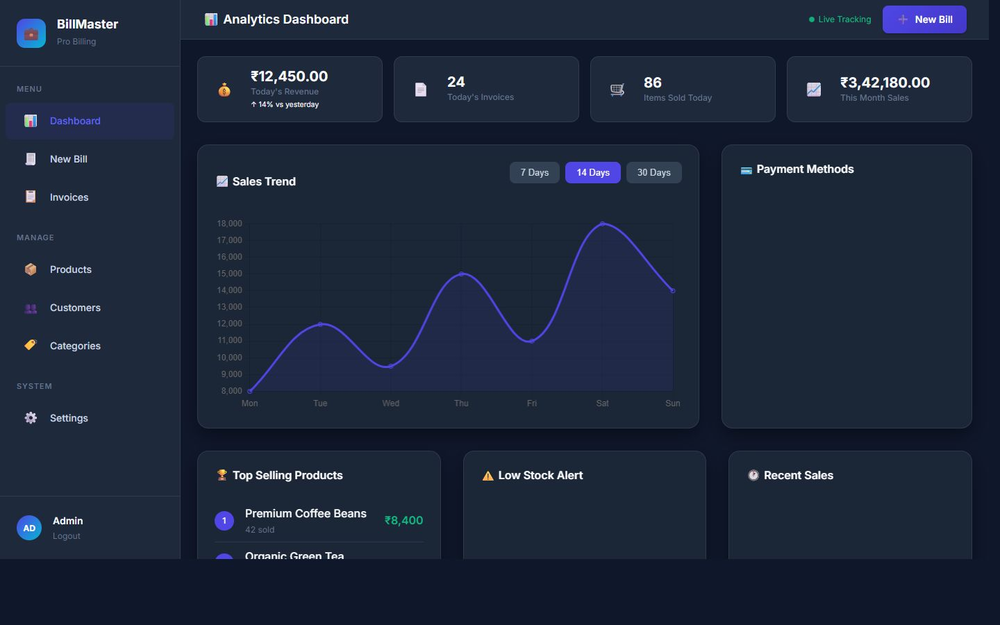
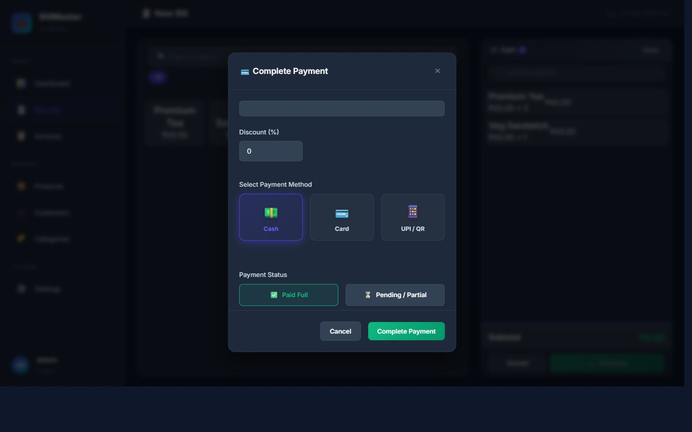

# BillMaster Pro - Python/Flask Backend

**Professional Billing & Institute Management System**

A complete billing and management system with a Python/Flask backend using SQLite database and modern HTML/CSS/JavaScript frontend.

---

## 🚀 Features

- **User Authentication** - Secure login/logout with session management and last-login tracking
- **Dynamic Dashboard** - Professional single-line analytics alignment with real-time tracking
- **Advanced Pricing** - Customer-specific status (New/Regular) with automated loyalty discounts
- **Smart Payment Workflow** - 3-grid professional payment system (Cash, Card, UPI)
- **UPI QR Code Integration** - Dynamic "Scan & Pay" QR generation with auto-calculated totals
- **Product Management** - CRUD operations for products with category-based GST mapping
- **Invoice Generation** - High-performance invoice creation with precise data serialization
- **Database Optimization** - Precision indexing for lightning-fast lookups and data integrity
- **Zero Configuration** - Uses SQLite, no external database setup required!
- **Rich Visual Interface** - Stunning dark-themed professional UI

---

## 📸 Visual Showcase

### Professional Dashboard & Analytics


### Smart Billing & Dynamic UPI QR


---

## 📁 Project Structure

```
azees project/
├── app.py                    # Main Flask application
├── requirements.txt          # Python dependencies
├── billmaster.db             # SQLite database (auto-created)
├── config/
│   └── database.py          # Database configuration & utilities
├── routes/
│   ├── __init__.py
│   ├── auth.py              # Authentication endpoints
│   ├── categories.py        # Categories API
│   ├── customers.py         # Customers API
│   ├── products.py          # Products API
│   ├── invoices.py          # Invoices API
│   ├── analytics.py         # Analytics & reporting
│   └── settings.py          # Settings API
├── assets/
│   ├── css/                 # Stylesheets
│   └── js/                  # JavaScript files
└── *.html                   # Frontend HTML pages
```

---

## 🛠️ Prerequisites

1. **Python 3.8+** - [Download Python](https://www.python.org/downloads/)

That's it! No external database required - SQLite is built into Python.

---

## 📦 Installation & Running

### Step 1: Install Python Dependencies

```bash
cd "azees project"
pip install -r requirements.txt
```

### Step 2: Run the Application

```bash
python app.py
```

The server will start at: **http://127.0.0.1:5000**

The SQLite database (`billmaster.db`) will be automatically created with:

- Default admin user
- Sample categories and products
- Default business settings

---

## 🔐 Default Login Credentials

| Username | Password | Role  |
| -------- | -------- | ----- |
| admin    | admin123 | Admin |

---

## 🌐 API Endpoints

All API endpoints are under `/api/` prefix:

### Authentication

- `GET/POST /api/auth.php?action=login` - User login
- `GET /api/auth.php?action=logout` - User logout
- `GET /api/auth.php?action=check` - Check session
- `POST /api/auth.php?action=register` - Register user (admin only)

### Products

- `GET /api/products.php?action=list` - List all products
- `GET /api/products.php?action=get&id=X` - Get product by ID
- `POST /api/products.php?action=create` - Create product
- `POST /api/products.php?action=update` - Update product
- `GET /api/products.php?action=delete&id=X` - Delete product

### Categories

- `GET /api/categories.php?action=list` - List all categories
- `POST /api/categories.php?action=create` - Create category
- `POST /api/categories.php?action=update` - Update category
- `GET /api/categories.php?action=delete&id=X` - Delete category

### Customers

- `GET /api/customers.php?action=list` - List all customers
- `GET /api/customers.php?action=get&id=X` - Get customer with invoices
- `POST /api/customers.php?action=create` - Create customer
- `POST /api/customers.php?action=update` - Update customer
- `GET /api/customers.php?action=delete&id=X` - Delete customer

### Invoices

- `GET /api/invoices.php?action=list` - List all invoices
- `GET /api/invoices.php?action=get&id=X` - Get invoice with items
- `POST /api/invoices.php?action=create` - Create invoice
- `POST /api/invoices.php?action=update_status` - Update payment status
- `GET /api/invoices.php?action=today_summary` - Today's summary

### Analytics

- `GET /api/analytics.php?action=dashboard` - Dashboard stats
- `GET /api/analytics.php?action=sales_chart&days=7` - Sales chart data
- `GET /api/analytics.php?action=top_products` - Top selling products
- `GET /api/analytics.php?action=low_stock` - Low stock products
- `GET /api/analytics.php?action=recent_invoices` - Recent invoices

### Settings

- `GET /api/settings.php?action=get` - Get all settings (including UPI IDs)
- `POST /api/settings.php?action=update` - Update settings
- `GET /api/settings.php?action=users` - List users (admin)
- `GET /api/settings.php?action=delete_user&id=X` - Delete user (admin)

### Performance Tools
- `finalize_db.py` - Database migration and indexing utility script

---

## 🔧 Technology Stack

### Backend

- **Python 3.8+**
- **Flask** - Web framework
- **Flask-CORS** - Cross-origin resource sharing
- **Flask-Session** - Session management
- **SQLite** - Built-in database (no setup required!)
- **bcrypt** - Password hashing

### Frontend

- **HTML5** - Structure
- **CSS3** - Styling with modern design
- **JavaScript** - Interactivity
- **Chart.js** - Data visualization

---

## 📝 Sample Data

The application comes pre-loaded with:

**Categories:**

- Beverages (Tea, Coffee, Soft Drinks)
- Snacks (Chips, Biscuits)
- Meals (Breakfast, Lunch, Dinner)
- Stationery (Pens, Notebooks)
- Services (Printing, Xerox)

**Products:**

- Tea (₹15), Coffee (₹20)
- Samosa (₹10), Sandwich (₹40)
- Notebook (₹30), Pen (₹10)
- Printing (₹2/page), Xerox (₹1/page)

---

## 🛡️ Security Features

- Password hashing with bcrypt
- Session-based authentication
- CORS configuration
- Input validation and sanitization
- SQL parameterized queries (prevents SQL injection)

---

---

## 🌐 Deployment

### Deploy to Render (Recommended)

You can deploy this project to Render for free! Render will automatically detect the `render.yaml` file and set up everything for you.

[](https://render.com/deploy?repo=https://github.com/abu-1221/billmaster-pro)

**Note:** For data persistence on Render's free tier, the SQLite database will reset on every deployment. For permanent storage, consider using Render's persistent disks or a managed PostgreSQL database.

### Deploy to Vercel

The project is also configured for Vercel. You can deploy it using the Vercel CLI:

```bash
vercel deploy --prod
```

**BillMaster Pro** - Built with ❤️ using Python/Flask + SQLite
